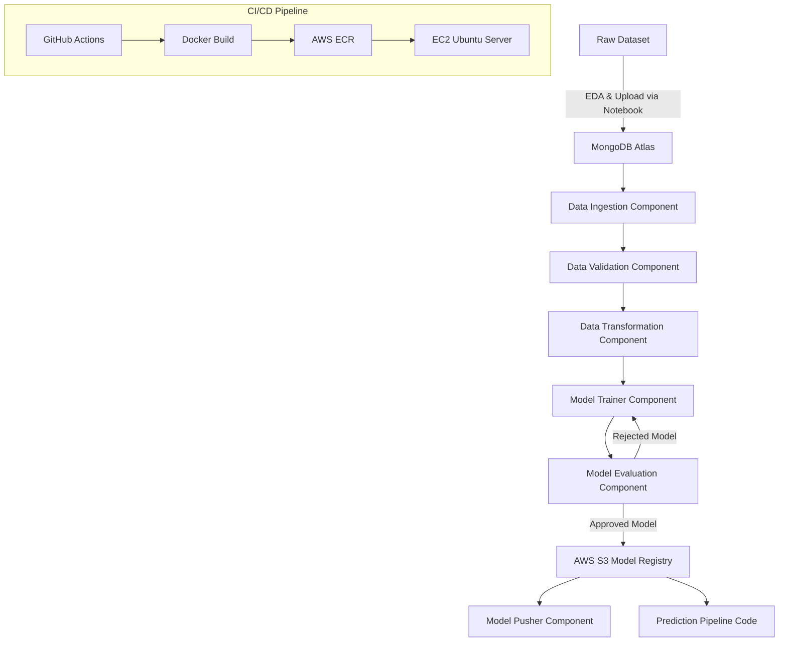

# 🚗 MLOps Project on Vehicle Insurance Prediction

## 🧠 TL;DR 

> **End-to-end MLOps project** implementing a production-grade ML pipeline with MongoDB-based data ingestion, schema-driven validation, model training & evaluation, AWS-backed model registry, Dockerized deployment, and fully automated CI/CD using GitHub Actions and EC2.

---

## 📌 Overview

This project demonstrates a **complete end-to-end MLOps pipeline**, covering everything from **data ingestion and validation** to **model training, evaluation, deployment, and CI/CD automation**.

The goal of this project is to showcase **production-grade machine learning practices** using modern tools like **MongoDB Atlas, AWS (S3, ECR, EC2), Docker, GitHub Actions**, and a **modular Python codebase** following industry-standard design patterns.

This repository is structured to be **scalable, maintainable, and cloud-ready**, making it suitable for real-world ML systems.



---

## 🧱 Project Structure & Template Setup

### 1. Project Template

* Project structure is generated by executing:

  ```bash
  python template.py
  ```

### 2. Local Package Management

* Local packages are configured using:

  * `setup.py`
  * `pyproject.toml`
* This enables clean imports across the project
* Reference documentation is provided in `crashcourse.txt`

---

## 🐍 Environment & Dependency Setup

### 3. Virtual Environment

```bash
conda create -n vehicle python=3.10 -y
conda activate vehicle
```

### 4. Install Dependencies

* All required modules are listed in `requirements.txt`

```bash
pip install -r requirements.txt
```

### 5. Verify Installation

```bash
pip list
```

Ensures local project packages are installed correctly.

---

## 🍃 MongoDB Atlas Integration

### MongoDB Setup

1. Create a MongoDB Atlas account and new project
2. Create an **M0 (Free Tier)** cluster
3. Create a database user (username & password)
4. Allow network access from anywhere:

   ```
   0.0.0.0/0
   ```
5. Obtain MongoDB connection string:

   * Driver: **Python**
   * Version: **3.6 or later**

### Notebook Integration

* Folder created: `notebook/`
* Notebook:

  ```
  mongoDB_demo.ipynb
  ```
* Dataset added to notebook
* Data pushed from notebook → MongoDB Atlas
* Data verified via **Browse Collections** (key-value format)

---

## 🧾 Logging, Exception Handling & EDA

* Custom logging implemented and tested via `demo.py`
* Custom exception handling implemented and tested via `demo.py`
* Notebooks added for:

  * Exploratory Data Analysis (EDA)
  * Feature Engineering

---

## 📥 Data Ingestion Pipeline

### Configuration & Constants

* Variables declared in:

  ```
  constants/__init__.py
  ```

### MongoDB Connection

* Implemented in:

  ```
  configuration/mongo_db_connections.py
  ```

### Data Access Layer

* Code added in:

  ```
  data_access/proj1_data.py
  ```
* Fetches MongoDB data and converts it to a Pandas DataFrame

### Entity & Artifact Definitions

* `entity/config_entity.py` → `DataIngestionConfig`
* `entity/artifact_entity.py` → `DataIngestionArtifact`

### Component Implementation

* `components/data_ingestion.py`
* Integrated into training pipeline
* Executed via `demo.py`

### MongoDB Environment Variable

**Bash**

```bash
export MONGODB_URL="mongodb+srv://<username>:<password>..."
echo $MONGODB_URL
```

**PowerShell**

```powershell
$env:MONGODB_URL="mongodb+srv://<username>:<password>..."
echo $env:MONGODB_URL
```

* `artifact/` directory added to `.gitignore`

---

## ✅ Data Validation

* Dataset schema defined in:

  ```
  config/schema.yaml
  ```
* Validation logic implemented using:

  ```
  utils/main_utils.py
  ```
* Component created following the same pipeline pattern as Data Ingestion

---

## 🔄 Data Transformation

* Transformation component built following pipeline structure
* Estimator logic added to:

  ```
  entity/estimator.py
  ```

---

## 🧠 Model Training

* Model Trainer implemented using the same component architecture
* Training artifacts tracked and managed consistently
* Estimator class extended in `entity/estimator.py`

---

## ☁️ AWS Integration (S3, IAM)

### AWS Setup

* Region: **us-east-1**
* IAM user created with `AdministratorAccess`
* Access keys generated and stored as environment variables

```bash
export AWS_ACCESS_KEY_ID="..."
export AWS_SECRET_ACCESS_KEY="..."
```

### Constants Configuration

```python
MODEL_EVALUATION_CHANGED_THRESHOLD_SCORE = 0.02
MODEL_BUCKET_NAME = "my-model-mlopsproj"
MODEL_PUSHER_S3_KEY = "model-registry"
```

### S3 Bucket

* Bucket Name: `my-model-mlopsproj`
* Public access enabled

### AWS Code Integration

* S3 connection logic:

  ```
  configuration/aws_connection.py
  cloud_storage/aws_storage.py
  ```
* S3 estimator utilities:

  ```
  entity/s3_estimator.py
  ```

---

## 📊 Model Evaluation & Model Pusher

* Model Evaluation compares new and existing models
* Model Pusher uploads approved models to S3 model registry

---

## 🔮 Prediction Pipeline & Web App

* Prediction pipeline code structure created
* Flask app configured in:

  ```
  app.py
  ```
* Supporting directories:

  ```
  static/
  template/
  ```

---

## 🚀 CI/CD Pipeline (Docker + GitHub Actions + AWS)

### Docker

* `Dockerfile`
* `.dockerignore`

### GitHub Actions

* Workflow directory:

  ```
  .github/workflows/aws.yaml
  ```

### AWS Services Used

* **ECR** – Docker image registry
* **EC2 (Ubuntu 24.04)** – Application hosting
* **IAM Users** – CI/CD access

### Self-Hosted GitHub Runner

* GitHub runner installed on EC2
* Connected to repository for CI/CD execution

### GitHub Secrets

Configured under:

```
Settings → Secrets and Variables → Actions
```

* `AWS_ACCESS_KEY_ID`
* `AWS_SECRET_ACCESS_KEY`
* `AWS_DEFAULT_REGION`
* `ECR_REPO`

---

## 🌐 Application Deployment

### EC2 Configuration

* Docker installed on EC2
* Port **5000** opened in security group

### Access Application

```
http://<EC2_PUBLIC_IP>:5000
```

### Model Training Endpoint

```
/training
```

---


